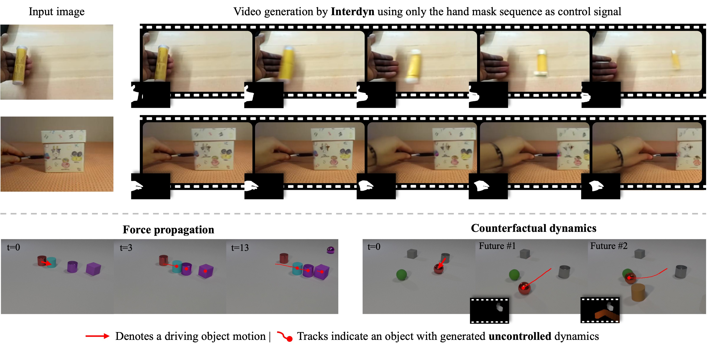

<div align="center">
<h1>InterDyn: Controllable Interactive Dynamics<br>with Video Diffusion Models</h1>
  
<a href="https://interdyn.is.tue.mpg.de/"></a>&nbsp;
<a href="https://arxiv.org/abs/2412.11785"></a>

[Rick Akkerman](https://rickakkerman.github.io/)<sup>1,2*</sup>,
[Haiwen Feng](https://havenfeng.github.io/)<sup>1*†</sup>,
[Michael J. Black](https://ps.is.mpg.de/person/black)<sup>1</sup>,
[Dimitrios Tzionas](https://dtzionas.com/)<sup>2</sup>,
[Victoria Fernández Abrevaya](https://is.mpg.de/~vabrevaya)<sup>1</sup>

<sup>1</sup>Max Planck Institute for Intelligent Systems, Tübingen, Germany;&nbsp;&nbsp;
<sup>2</sup>University of Amsterdam, the Netherlands
<br>
<small>* equal contribution &nbsp;&nbsp;† project lead</small>


</div>


## Setup
1. Clone this repository:
```bash
git clone https://github.com/rickakkerman/InterDyn.git
```
2. Install dependencies (please refer to [requirements.txt](requirements.txt)):
```bash
pip install -r requirements.txt
```
3. Install FFMPEG:
```bash
conda install -c conda-forge ffmpeg -y
```


### Model
[InterDyn](https://huggingface.co/rickakkerman/InterDyn) is available in the Hugging Face Model Hub. The 256×256 version on Something-Something-v2 and the version on CLEVRER will be released at a later date.


### Inference
Run inference on all examples:

```bash
python demo.py
```

Run inference on one specific example:

```bash
python demo.py --id "243"
```


## Acknowledgements
Check out the following great repositories:
[svd-temporal-controlnet](https://github.com/CiaraStrawberry/svd-temporal-controlnet),
[SAM2](https://github.com/facebookresearch/sam2),
[CoTracker](https://github.com/facebookresearch/co-tracker).


## Checklist
- [x] Release demo code
- [ ] Release data preprocessing code
- [ ] Release training code
- [ ] Release evaluation code


## Citation
If you find this work helpful, please consider citing:

```bibtex
@inproceedings{akkerman2025interdyn,
  title={InterDyn: Controllable Interactive Dynamics with Video Diffusion Models},
  author={Akkerman, Rick and Feng, Haiwen and Black, Michael J. and Tzionas, Dimitrios and Abrevaya, Victoria Fern{\'a}ndez},
  booktitle={Proceedings of the Computer Vision and Pattern Recognition Conference},
  pages={12467--12479},
  year={2025}
}
```